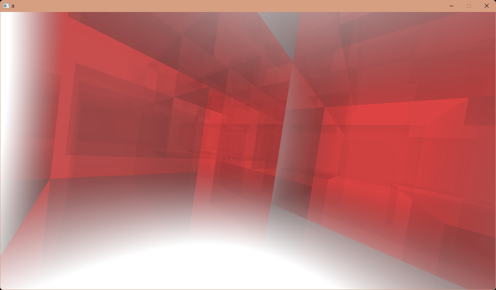

# it

# Compiling
For both os you will need CMake. You can change the generator (Makefile, Ninja,
Visual Studio, etc..) in the first call to CMake, passing the `-G <generator>`
argument.

## Specially for Windows
In `CMakeLists.txt`: change the line with `set(VCPKG_TARGET_TRIPLET x64-linux)`
to `set(VCPKG_TARGET_TRIPLET x64-windows-static)` and uncomment the `WIN32`.

## Specially for Linux
You will have to install some packages, on Arch I had to only install `glew`,
but that maybe different for your setup.

## Windows and Linux
You will need Visual Studio (or the `cl.exe` compiler) for windows and a C
compiler for linux.

Run:

    git clone --recursive <this-repo>
    mkdir build
    cmake -S . -B build -DCMAKE_BUILD_TYPE=Release
    cmake --build build

The executable will be somewhere inside the `build` directory.

